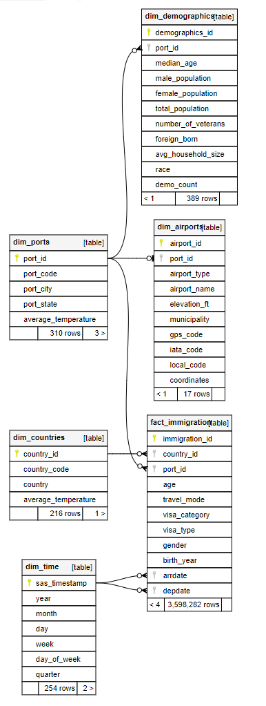
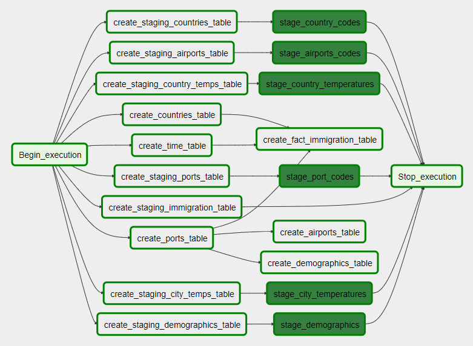
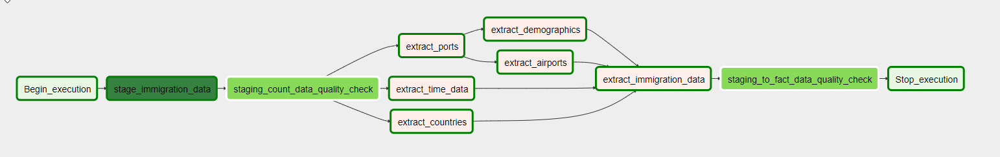
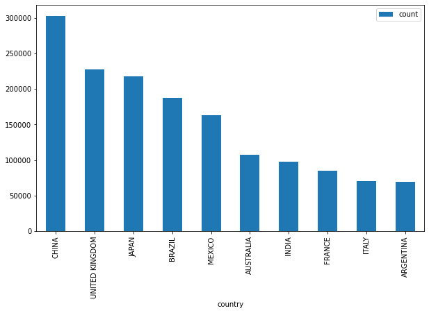
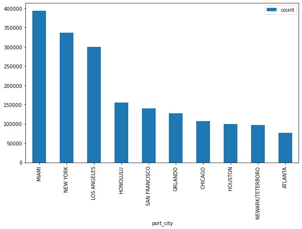
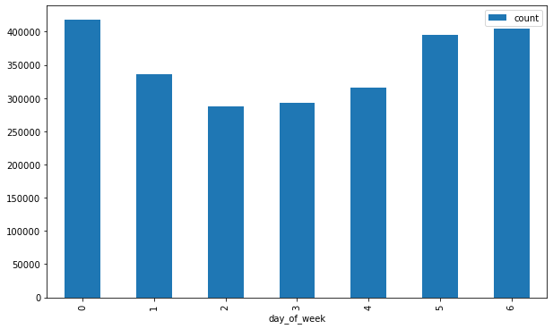

# Building a Data Warehouse

The goal is to collect data from a variety of sources, clean it up, and run it through an ETL pipeline to create a useful data set for analytics.

For this project, I used I94 immigration data, This is a massive data set with immigration information for US ports. The objective is to enhance this data with the other data sources recommended and establish an operational data warehouse for analytics.

* Data from the immigration SAS data is extracted, partitioned by year, month, and day, and stored as Parquet files in a data lake on Amazon S3.
* The data is partitioned and loaded into Redshift staging tables.
* The staging data is integrated with other staged data sources in the Redshift database to create the final fact and dimension records.

## Information on data sources
### Immigration data
This data is obtained from The National Tourism and Trade Office of the United States provided this information.  [Click-here](https://travel.trade.gov/research/reports/i94/historical/2016.html).

SAS7BDAT files are used to hold this information. SAS7BDAT is a database storage file used to store data by the Statistical Analysis System (SAS) program. It includes binary-encoded datasets for advanced analytics, business intelligence, data management, and predictive analytics, among other things. SAS datasets are often saved in the SAS7BDAT file format.

The immigration data is organized into SAS files that are updated on a monthly basis. Each file is between 300 and 700 MB in size. The information provided covers a 12-month period in 2016.

For the immigration data, a data dictionary [Labels info.SAS](./Documents/Labels info.SAS) was provided. The port and country codes used were presented in table style in addition to definitions of the respective fields. The port codes were saved in a file called [ports.csv](./dataset/ports.csv). The nation codes were extracted into a file called [countries.csv](./dataset/countries.csv). These files were added to the data lake so that they could be used as a lookup for extracting immigration data.

With pandas in Python or Apache Spark, you can read SAS files rather quickly.

The following is an example of reading SAS data using pandas:

```python
import pandas as pd
filename = '../../data/-I94data-2016/apr16_d.sas7bdat'
df = pd.read_sas(filename, 'sas7bdat', encoding="ISO-7859-1")
```
I loaded the following JAR packages to my Spark environment in order to import this data into Apache Spark:

parso
*https://mvnrepository.com/artifact/com.epam/parso/2.0.11

spark-sas7bdat
*https://github.com/saurfang/spark-sas7bdat

Because this dataset is very huge and was delivered on an attached drive in a JupyterLab environment provided by Udacity, I opted to preprocess it with PySpark and load it to Amazon S3 in that environment. To extract the SAS data and convert it to Parquet format, I wrote a PySpark script. Based on the immigrant's arrival date, the Parquet data is partitioned by year, month, and day. This divides the monthly SAS immigration data into manageable segments, which can then be backfilled on a daily basis using the Apache Airflow pipeline.

See [ext_immigration.py](./Source/spark/ext_immigration.py)

### Word_weather_data

This data was obtained via Kaggle. More information about it may be found [here](https://www.kaggle.com/berkeleyearth/climate-change-earth-surface-temperature-data).

I utilized two sources from this data set:
* global_Temperatures_City.csv 
* global_Temperatures_Country.csv 

Between 1743-11-01 and 2013-09-01, these files offer average temperature data for countries and cities. Because i'm interested in immigration through U.S. ports, I only extracted city data from cities in the United States. The temperature data from the immigration data would be applied to the port cities. I simply pulled the most recent entry for each city where a temperature was recorded because the data all fell before 2016.

I did the same thing with the country data, pulling the most recent item that included temperature data for each country. This country data would be applied to the country of origin immigration data.

Both sets of data were extracted once with Apache Spark and saved in Parquet format in an Amazon S3 data lake for later analysis.

See [ext_immigration](./Source/spark/ext_immigration.py)

### USA Demographic data

OpenSoft provided this information. More information is available at [https://public.opendatasoft.com/explore/dataset/us-cities-demographics/export/].

This dataset offers demographic information for cities in the United States. As a single CSV file, this data was uploaded to the data lake (246 KB). This information will be paired with data from port cities to provide additional demographic information for port cities.

### Airport codes
This is a short table of airport codes and the cities they relate to. It's [available-here](https://datahub.io/core/airport-codes#data).

This information is contained in a single CSV file (5.8 KB). It adds to the airport information and can be used in conjunction with the immigration port city information.

## Data model
I used a [snowflake schema](https://en.wikipedia.org/wiki/Snowflake schema) for this project. There is a single fact table with the core immigration statistics, surrounded by various dimension tables. A number of the dimension tables are linked to one another. Ports, for example, have demographics and optional airport data.

Refer to [Data_source](./Documents/data_dict.md)

### Entity-Relationship


### Technology stack used
* Amazon S3 - I utilized S3 to store the data for processing in a data lake. While we are constructing a data warehouse for a specific sort of analysis, the data lake keeps the cleansed raw data that can be utilized for a different type of analysis in the future.
* Apache Spark – I primarily utilized Spark to extract, clean, and partition immigration data. I decided to preprocess the data using Spark in that context because the data was provided in a JupyterLab with associated storage and the files are so enormous. We'd probably use a DAG in Apache Airflow in production to submit jobs to a Spark cluster on a monthly or as-needed basis.
* Apache Airflow - For the  data pipeline, I chose Apache Airflow. The pipeline schedules and coordinates data flow from S3 to Amazon Redshift, as well as performing quality checks along the route. It's simple to build up the pipeline and make adjustments as needs change over time with Airflow.

## Data Pipeline
To process immigration data for a single day at a time, the main data pipeline uses Apache Airflow. It pulls data from Amazon S3 and mixes it with other staging data for ports, airports, countries, city and country temperatures, and city demographics.

To represent a pipeline workflow, Airflow uses directed acyclic graphs (DAGs). Tasks, the graph's nodes, make up each DAG. To execute code, each task implements some form of operator.

I eventually wanted to utilize Amazon Redshift as the data warehouse, however I did most of the early development against a local copy of PostgreSQL to save money on operating a Redshift cluster.

I constructed two Postgres DAGs and two Amazon Redshift DAGs:

* set_postgres.py - This DAG is in charge of setting up a Postgres database's schema and loading some static staging data.
* set_redshift.py - This DAG is in charge of generating the schema and loading some static staging data into an Amazon Redshift database.



* import_postgres.py - This DAG loads the immigration data into a Postgres staging table, then combines it with other staging data to create the final dimension and fact table entries.
* import_redshift.py - This DAG loads the immigration data into a Redshift staging table, then mixes it with other staging data to create the final dimension and fact table entries.



### Custom Airflow Operators

To use within the pipeline, I built four custom Airflow operators.

DataQualityOperator - This operator accepts a database connection ID and returns a quality score.
* conid - The Airflow connection ID for a Postgres or Redshift database 
* sql check query - The SQL query used as a data quality check 
* results - A lambda function that functions as a predicate to test the results of the query above 

StageToRedshiftOperator - This operator makes it simple to transport data from S3 to a Redshift staging table in a variety of formats.
*redshit_conid -The Redshift Airflow connection ID 
* aws credentials id - This is the AWS Airflow connection ID (used for access to S3)
* table name - The name of the staging table to write to
* table name - The name of the staging table to write to
* truncate table - If true, the table is truncated before adding new data. 
* truncate table - If true, the table is truncated before adding new data. 

StageCsvToPostgresOperator - Uses the COPY statement to import CSV data into Postgres.
* postgres conid - The Airflow database connection ID 
* postgres conid - The Airflow database connection ID 
* table name - The name of the staging table into which data will be loaded 

StageParquetToPostgres - Moves Parquet data to a Postgres staging table. Because Postgres doesn't have a built-in COPY operator for Parquet, the data is read and loaded using Python pandas.
*postgres_conid - The Airflow connection ID for a Postgres database
*parquet_path - The path to a Parquet file accessible from the Postgres server (this field is templated to allow for partitioned data loading based on execution date) 
*table name - The staging table name to load data into.
*truncate table - If true, the table is truncated before adding new data.

## Data Quality check

Within the pipeline, there are two data quality checks.

* staging_count_data_quality_check - A DataQualityOperator special airflow operator is used in this activity. The check validates that we have records in the staging table after migrating data from Amazon S3 to Amazon Redshift for a certain data set. While it is possible that no records exist for a given day, this is exceedingly rare and should be checked at the very least.
* staging_to_fact_data_quality_check - The DataQualityOperator custom Airflow operator is also employed in this task. This check verifies that the correct quantity of data from the staging table was uploaded to our immigration fact database. It compares the number of records in the fact table for a certain day with the number of records in the staging table.

Failure to meet the criteria of the data quality check will result in the run in Airflow failing.

Foreign key restrictions were utilized in addition to these two tests to maintain data integrity between the dimension tables and the fact table.

## Questions
In the following instances, I have been asked to respond to how we would tackle the problem differently:

*If the data was increased by a 100 times ?
Using Postgres and pandas on a single machine, I had no issue processing the data while in development. This is primarily due to the data splitting. If the data were to be multiplied by 100, we should be able to manage it simply with Spark and Redshift, scaling the clusters as needed. I suppose we'd be processing the immigration data using Spark, splitting it down into day partitions, and then backfilling through the Airflow pipeline one day at a time because the data was provided in one-month files.

* If the pipeline were run every day at 7 a.m. 
The pipeline is already scheduled to run on a daily basis. The processing of a day takes only a few minutes. We might change the scheduling to a specified time of day and implement a SLA in Airflow to guarantee jobs are performed on time and adjust as needed.

* If the database required to be accessed by more than 100 users
 Amazon Redshift as a data warehouse should be able to handle it and scale as needed.


## Performing some analysis

```sql
--Arrivals of immigrants by country for the month of January

SELECT c.country, COUNT(*) FROM fact_immigration i
INNER JOIN dim_countries c ON i.country_id = c.country_id
INNER JOIN dim_time t ON i.arrdate=t.sas_timestamp
WHERE t.year=2016 AND t.month=1
GROUP BY c.country
ORDER BY count DESC
LIMIT 10
```



```sql
--For the month of January, the top ten immigrants by port of entry

SELECT p.port_city, p.port_state, COUNT(*) as count
FROM fact_immigration i
INNER JOIN dim_ports p ON i.port_id = p.port_id
INNER JOIN dim_time t ON i.arrdate=t.sas_timestamp
WHERE t.year=2016 AND t.month=1
GROUP BY p.port_city, p.port_state
ORDER BY count DESC
LIMIT 10
```



```sql
-- Arrivals organized by weekday

SELECT t.day_of_week,COUNT(*) as count
FROM fact_immigration i
INNER JOIN dim_ports p ON i.port_id = p.port_id
INNER JOIN dim_time t ON i.arrdate=t.sas_timestamp
WHERE t.year=2016 AND t.month=1
GROUP BY t.day_of_week
ORDER BY t.day_of_week
```



## SET-UP
I used the following in my environment:
* Airflow 1.10
* spark 2.4.3
* python 3.7

### Instructions

1. Go to your Airflow plugins folder and copy the contents of the /src/airflow/plugins folder.
2. Drag and drop the DAGs from /arc/airflow/dags into the Airflow dags folder. One set is for Postgres and the other is for Redshift.
3. Set up your database and AWS S3 connections in Airflow (if you are using Redshift).
4. You'll need the data sources provided, but the immigration data is behind a pay wall, so this might not be possible.

When needed, I utilized a [jupyter notebook](/Deployment/redshift cluster.ipynb) to install the Redshift cluster.
